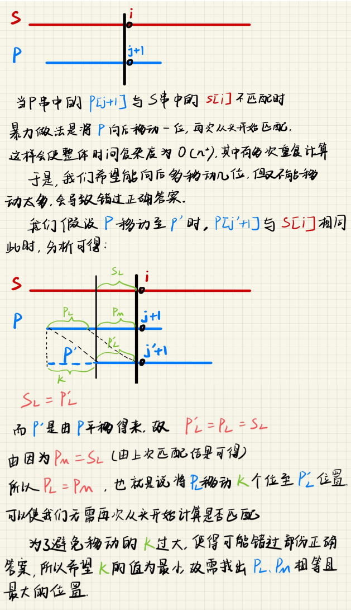

## KMP字符串匹配算法

## 思路：

### 前置知识：

对于模板字符串P,生成其前缀表。其含义代表该字符串中对于每一位字符的**最长公共前缀和后缀**

字符串的前缀：符号串左部的任意子串（或者说是字符串的任意首部）

字符串的后缀：符号串右部的任意子串（或者说是字符串的任意尾部）
 举例子, **"abcde"**,前缀包括但不限于: **{a},{ab},{abc}..{abcde}**,后缀同理**{e},{de},{cde}**...

**注意**：在KMP中我们所讨论的是**真前缀**和**真后缀**，其含义为前后缀原有基础上剔除源串自身，当我们限定 j为最后一个字母的下标时,也就是变成 [1~j]的前缀和后缀的问题.

例如：对于如下模板字符串**P**

|  a   |  b   |  a   |  b   |  c   |
| :--: | :--: | :--: | :--: | :--: |
|  0   |  0   |  1   |  2   |  0   |

通过观察可得其子串可为：

​	a						很明显可以看出该子串的最长公共前后缀长度为 0

​	ab					  可以看出该字串最长公共前后缀长度也为0

​	aba					可以看出该字串最长公共前后缀长度也为1，因为ab和ba不相同

​	abab                  同理，最大长度为2

​	ababc				 最大长度为0

于是我们就能够得出以上前缀表格，这也就是KMP中所要用到的 **next 数组**

对于任意第 **i** 位字符，**next[i]**表示在 **p[1,i]**中最长的**与前缀相等的后缀的长度**

### 那么为什么要找最长的公共前后缀呢？通过下图分析：

2.明确了这一点再研究如何求的**P**串的**next**数组

​	现在要求next[i]的值，假设已经求得了next[i-1]的值，此时我们只需判断 **p[ i ]** 是否等于 **p[ j + 1 ]**,若等于，则

 **next[ i - 1 ] = next[ i ] + 1**,若不等于，则让 **j = next[ j ]**，也就是让